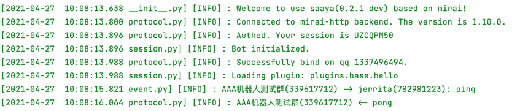

# Saaya Framework on Mirai

> 目前最新版本为： `2.0.1 dev`
> 
> Saaya 以迁移至 mirai-api-http v2，下载时请注意版本
> 
> 此框架目前正在开发中，请暂时使用 `PyCharm` 以获得较好的代码内文档体验

`Saaya`  是一个为了与群内 `cdd` 对抗而开发的基于 `mirai-api-http` 的轻量机器人框架，使用语言为 `Python`


## 快速开始

`Saaya` 基于 `mirai-api-http` ，因此你的第一步应该是安装服务端，这里推荐使用 `MCL`。


### 服务端部署

1. 参见 [MCL](https://github.com/iTXTech/mirai-console-loader) 提供的教程，安装服务端程序，并运行一次生成对应文件
2. 参考 [mirai-api-http](https://github.com/project-mirai/mirai-api-http) ，安装对应的插件
3. 运行一次 `MCL` 并关闭，修改配置文件，配置 `qq` 自动登录并打开 `mirai-api-http` 的 `websocket` 选项


### 你的第一个应用

编写主函数 `main.py`

```python
from saaya.session import Bot
from private import address, verifyKey, botqq

if __name__ == '__main__':
    bot = Bot(address, verifyKey)  # 创建一个 Bot 实例
    bot.bind(botqq)  # 登陆 Bot （注意：需要主程序已登陆对应 qq）

    bot.registerPlugins([
        # 'plugins.turing.main',
        'plugins.base.reply'
    ])  # 插件注册，规范如上

    bot.loop()  # 开始监听事件循环
```


### 插件规范

在上一步中，我们注册了一个名为 `plugins.base.reply` 的插件，在 `BrickBot` 中，插件以目录的最深层为终点，也就是说明这个插件的路径应该是 `plugins/base/reply.py`，如下便是一个最简单的插件

```python
from saaya.utils import PluginManager
from saaya.event import GroupMessage
from private import test_groups


@PluginManager.registerEvent('GroupMessage')
async def hello(event: GroupMessage):
    if event.group.uid in test_groups:
        if event.message.getContent() == 'ping':
            event.group.sendMessage('pong')
```


## Hello world

将插件放置到相应的目录，并运行 `main.py` 



可以看到插件已经成功加载，并且机器人回复了你 `pong`


## 鸣谢

- `Mirai` 开源项目 https://github.com/mamoe/mirai
- `mirai-api-http` 提供的接口支持

